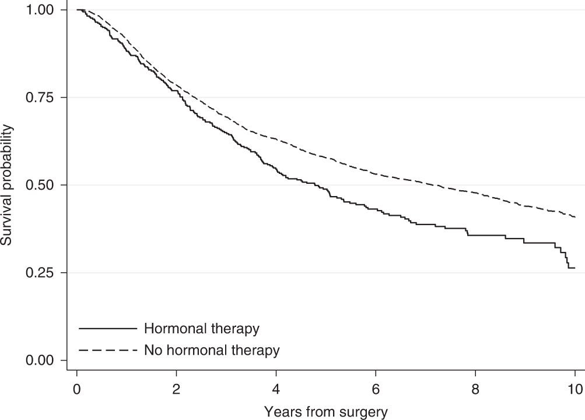

# (PART) Part III: Survival data {-}


# Working with time-to-event data 

A data type that is commonly found in clinical trials is **time to event data**. This type of data captures the amount of time that elapses before a particular event happens. As a sub-field of statistics, survival analysis has been around for a long time, as people have thought about and worked with data like mortality records ([most notably John Graunt, who used the 'Bills of Mortality' during the 1600s to better understand the plague and other causes of death](https://rss.onlinelibrary.wiley.com/doi/full/10.1111/1740-9713.01421)). However, it developed rapidly during the many cancer related clinical trials of the 1960s and 1970s. In these cases, the event in question was very often death, and which is why this branch of statistics came to be known as **survival analysis**. However, the event can be many other things, and indeed can be a positive outcome (for example being cured of some condition). Time-to-event data also appears in other applications, such as engineering (eg. monitoring the reliability of a machine) and marketing (eg. thinking of the time-to-purchase). As well as the books already mentioned, this chapter makes use of @collett_surv.

Usually, survival data is given in terms of time, but it can also be the number of times something happens (for example, the number of clinic appointments attended) before the event in question occurs.

Survival data is trickier to handle than the data types we have seen so far, for two main reasons. Firstly (and simply) survival data is very often skewed, so even though it is (usually) continuous, we can't just treat it as normally distributed. Secondly (and more complicatedly, if that's a word) with time-to-event data we don't usually observe the full dataset. 

## Censored times 

If a trial monitors a sample of participants for some length of time, many will experience the event before the trial is finished. However, for some of the sample we likely won't observe the event. This could be because it doesn't happen within the lifetime of the trial, or it could be because the participant exits the trial prematurely for some reason (eg. withdrawal), or simply stops attending follow-up appointments after a certain times. For these participants, we do know that they had not experienced the event up to some time $t$, but we don't know what happened next. All we know is that their time-to-event or **survival time** is greater than that time $t$. These partial observations are known as **censored** times, and in particular as **right-censored** times, because the event happens *after* the censored time. It is possible (but less common) to have *left-censored* or *interval-censored* data, but in this course we will deal only with right-censoring.

```{r censor, fig.cap = "An example of some censored data. The dashed line at time 10 indicates the end of the trial period."}
df_cens = data.frame(
  id = as.factor(1:10),
  out = c(8,7,6,12,12,3,4,3,8,7),
  Type = as.factor(c("Event","Event","Censored", "Censored", "Censored", "Censored", "Censored", "Censored","Event","Censored"))
)

ggplot(data=df_cens) + 
  geom_segment(aes(x=0, xend=out, y=id, yend=id)) + 
  geom_point(aes(x=out, y=id, pch=Type, col=Type), size=4) +
  ylab("Participant") +
  geom_vline(xintercept=10, lty=2) +
  xlab("Time") +
  theme_bw()

```

If we were to treat censored times as observations, ie. as though the event had happened at time $t$, we would bias the results of the trial very seriously. The survival times reported would be systematically shorter than the true ones. For example, in the dataset shown in Figure \@ref(fig:censor), we would estimate the survival probability at time 10 as 0.2, since only two of the 10 participants were still in the trial after time 10. But it may well be that some of the participants whose observations were censored before $t=10$ were still alive at $t=10$.

If we were to remove the censored times, and only analyse the data in which the event was observed during the lifespan of the trial, we would be losing data and therefore valuable information. This approach may well also lead to bias, for example if some subset of patients died quite soon into the trial, but the remainder lived a long time (past the end of the trial). If our analysis ignores the survivors, we are likely to underestimate the general survival time. In the dataset in Figure \@ref(fig:censor) there are five participants (3,6,7,8,10) whom we are no longer able to observe at time 10, but of whom none had experienced the event by the point at which they were censored.

So we know that we need to somehow include these censored times in our analysis. How we do so will depend on our approach.

## The Survival Curve and the Hazard function {#survhaz}

The field of survival analysis is relatively unusual in statistics, in that it isn't treated predominantly parametrically. For most continuous data, it is overwhelmingly common to work with the normal distribution and its friends (eg. the student's t distribution). Similarly binary data is dominated by the binomial distribution. Inference is therefore often focussed on the parameters $\mu,\;\sigma$ or $p$, as an adequate summary of the truth given whatever parameteric assumption has been made. 

However, in survival analysis, it is often the case that we focus on the whole shape of the data; there isn't an accepted dominating probability distribution. In order to be able to deal with time-to-event data, we need to introduce some key ways of working with such data. 

The **survival time** (or time-to-event) $t$ for a particular individual can be thought of as the value of a random variable $T$, which can take any non-negative value. We can think in terms of a probability distribution over the range of $T$. If $T$ has a probability distribution with underlying *probability density function* $f\left(t\right)$, then the *cumulative distribution function* is given by

$$F\left(t\right) = P\left(T<t\right) = \int\limits_0^t f\left(u\right)du, $$
and this gives us the probability that the survival time is less than $t$.

:::{.definition}
The **survival function**, $\operatorname{S}\left(t\right)$, is the probability that some individual (in our context a participant) survives longer than time $t$. Therefore $\operatorname{S}\left(t\right) = 1 - F(t)$. 
Conventionally we plot $\operatorname{S}\left(t\right)$ against $t$ and this gives us a **survival curve**.
:::

We can immediately say two things about survival curves:

  1. Since all participants must be alive (or equivalent) at the start of the trial, $\operatorname{S}\left(0\right)=1$.
  2. Since it's impossible to survive past $t_2>t_1$ but not past time $t_1$, we must have  $\frac{d\operatorname{S}\left(t\right)}{dt}\leq{0}$, ie. $\operatorname{S}\left(t\right)$ is non-increasing.
  
One summary that is often used is the **median survival time**, the time at which half of the participants have already experienced the event, and half haven't.
  
Figure \@ref(fig:egsurvival) shows two survival curves, comparing different therapies. We see that the hormonal therapy reduces the survival time slightly compared to no hormonal therapy.  
  
```{r egsurvival, fig.cap = "An example of two survival curves, taken from @syriopoulou2022standardised."}

```

Following on from the survival function, we have another (slightly less intuitive) quantity: the **Hazard function** $h\left(t\right)$.

:::{.definition}
The **Hazard function** $h(t)$ is the probability that an individual who has survived up to time $t$ fails just after time $t$; in other words, the instantaneous probability of death (or *experiencing the event*) at time $t$.
:::

If we use $T$ to denote the random variable of survival time (or time-to-event) then $\operatorname{S}\left(t\right)$ and $h(t)$ are defined by


\begin{align*}
\operatorname{S}\left(t\right)&= \operatorname{Pr}\left(T>t\right)\\
h\left(t\right) & = \lim\limits_{s\rightarrow{0+}}\frac{\operatorname{Pr}\left(t<T<t+s\mid{T>t}\right)}{s}.
\end{align*}

Using the definition of conditional probability, we can rewrite $h(t)$ as 


\begin{align*}
h\left(t\right) & = \lim\limits_{s\rightarrow{0+}}\frac{\operatorname{Pr}\left(t<T<t+s\mid{T>t}\right)}{s} \\
 & = \lim\limits_{s\rightarrow{0+}}\left[\frac{1}{\operatorname{Pr}\left(T>t\right)}\cdot\frac{\operatorname{Pr}\left(\left(t<T<t+s\right)\cap\left(T>t\right)\right)}{s}\right] \\
 & = \lim\limits_{s\rightarrow{0+}}\left[\frac{1}{\operatorname{Pr}\left(T>t\right)}\cdot\frac{\operatorname{Pr}\left(t<T<t+s\right)}{s}\right]\\
 & = \frac{f\left(t\right)}{\operatorname{S}\left(t\right)},
\end{align*}


where $f\left(\cdot\right)$ is the probability density of $T$. The hazard function can take any positive value (unlike the survival function), and for this reason $\log\left(h\left(t\right)\right)$ is often used to transform it to the real line. The hazard function can also be called the 'hazard rate', the 'instantaneous death rate', the 'intensity rate' or the 'force of mortality'.

As we hinted before, there are fundamentally two ways to deal with survival data: we can go about things either parametrically or non-parametrically. Unusually for statistics in general, the non-parametric paradigm is prevalent in survival analysis. We will consider some methods from both paradigms.

### The Kaplan-Meier estimator

The **Kaplan-Meier estimator** is a non-parametric estimate of $\operatorname{S}\left(t\right)$, originally presented in @kaplan1958nonparametric. The idea behind it is to divide the interval $\left[0,\;t\right]$ into many short consecutive intervals,

$$\left[0,\,t\right] = \bigcup\limits_{k=0}^K \left[s_k,\,s_{k+1}\right],$$
where $s_k<s_{k+1}\;\forall{k}$, $s_0=0$ and $s_{K+1}=t$. We then estimate the probability of surviving past some time $t$ by multiplying together the probabilities of surviving the successive intervals up to time $t$. No distributional assumptions are made, and the probability of surviving interval $\left[s_k,\,s_{k+1}\right]$ is estimated by $1-Q$, where 

$$Q = \frac{\text{Number who die in that interval}}{\text{Number at risk of death in that interval}}.$$
More precisely, let's say that deaths are observed at times $t_1<t_2<\ldots < t_n$, and that the number of deaths at time $t_i$ is $d_i$ out of a possible $n_i$. Then for some time $t\in\left[t_J,\,t_{J+1}\right)$, the Kaplan-Meier estimate of $\operatorname{S}\left(t\right)$ is 

$$\hat{\operatorname{S}}\left(t\right) = \prod\limits_{j=0}^J \frac{\left(n_j - d_j\right)}{n_j}.$$

Notice that the number of people at risk at time $t_{j+1}$, denoted $n_{j+1}$, will be the number of people at risk at time $t_j$ (which was $n_j$), minus any who died at time $t_j$ (which we write as $d_j$) and any who were censored in the interval $\left[t_j,\,t_{j+1}\right)$. In this way, the Kaplan-Meier estimator incorporates information from individuals with censored survival times up to the point they were censored.

@greenwood1926natural derived an approximation to the variance of the Kaplan-Meier estimate of survival curve, given by

$$\hat{V}\left(t\right) = \left(\hat{\operatorname{S}}\left(t\right)\right)^2\sum\limits_{t_{i}\leq{t}} \frac{d_i}{n_i\left(n_i-d_i\right)} $$

This uses the Delta method (which we've seen before in the binary outcome chapters) and makes the assumption that events at time $t_i$ are independent binomial draws from a population of size $n_i$. We can use this to form confidence intervals for the survival curve, and indeed `ggsurvfit` can add these automatically to plots.

:::{.example #surveg1}
@edmonson1979prognosis conducted a trial on patients with advanced ovarian cancer, comparing cyclophosphamide (group $C$) with a mixture of cyclophosphamide and adriamycin (group $T$). Patients were monitored, and their time of death was recorded, or a censoring time if they were alive at their last observation. The data are shown in Table \@ref(tab:ovdata).

```{r ovdata}
ov_df = ovarian[order(ovarian$futime),1:2]
names(ov_df) = c("FU_time", "FU_status")
knitr::kable(ov_df, caption = "Ovarian cancer data. FU time gives the survival or censoring time, and FU status the type: 0 for a censored observation, 1 for death. ") %>% 
  kable_styling("striped") %>%
  scroll_box(height = "600px")
```


We see that there are 26 individuals, and we have the time of death for 12 of them. The remaining 14 observations are censored.
We can use this data to calculate the Kaplan-Meier estimator of the survival curve, as shown in Table \@ref(tab:ovkm). The columns are (from left to right): time $t_j$; number at risk $n_j$; number of events/deaths $d_j$; number of censorings in $\left[t_{j-1},\,t_j\right)$; estimate of survival curve and standard error of the estimate (using Greenwood's formula).

```{r ovkm}
surv_object <- Surv(time = ovarian$futime, event = ovarian$fustat)
fit_ov = survfit(surv_object ~ 1, data=ovarian)
sum_ovfit = summary(fit_ov)
ovfit_df = data.frame(
  time = sum_ovfit$time,
  n_risk = sum_ovfit$n.risk,
  n_event = sum_ovfit$n.event,
  n_cens = sum_ovfit$n.censor,
  survival = sum_ovfit$surv
)
se_surv_sumterm = sapply(
  1:nrow(ovfit_df),
  function(i){
    ovfit_df$n_event[i] / (ovfit_df$n_risk[i]*(ovfit_df$n_risk[i] - ovfit_df$n_event[i]))
  }
)
SE_surv  = sapply(
  1:nrow(ovfit_df),
  function(i){
    ovfit_df$survival[i] * sqrt(sum(se_surv_sumterm[1:i]))
  }
)

ovfit_df$SE_surv = SE_surv

  
  


kable(ovfit_df, caption = "Kaplan-Meier estimator calculations for ovarian cancer dataset.")%>%kableExtra::column_spec(c(1,5), bold = TRUE)

```

Figure \@ref(fig:kmov2) shows the Kaplan-Meier survival curve estimate for the `ovarian` data. Using the package `ggsurvfit` we can add in a table below the $x$ axis showing the number at risk and the number of events at some times points.


```{r kmov2, fig.cap = "Kaplan-Meier estimate of survival curve for ovarian cancer data with a 95% confidence level."}
survfit(Surv(time = ovarian$futime, event = ovarian$fustat) ~ 1, data=ovarian) %>%
  ggsurvfit() +
  labs(x="Time", y="Estimated survival curve")+
  ylim(0,1)+
  add_risktable() +
  add_confidence_interval()
```

The Kaplan-Meier estimate may seem a bit dissatisfying, since it stops changing at $t=638$ with a probability of $0.497$. However, this is really (in a non-parametric setting) all we can say with the data available; 10 of the participants were definitely still alive at $t=638$, and some of the other censored participants may also have been.

:::


For a clinical trial, we want to plot the survival curves separately for the different treatment groups. This will give a first, visual, idea of whether there might be a difference, and also of the suitability of certain models (we'll talk about this later).

:::{.example #veteranmyeloid}

Figure \@ref(fig:ovarian) shows the Kaplan Meier plots for the ovarian cancer data from Figure \@ref(fig:kmov2), this time split by treatment group.


```{r ovarian, fig.cap = "Kaplan-Meier curves for the ovarian cancer data, split by treatment group."}
survfit(Surv(time = ovarian$futime, event = ovarian$fustat) ~ rx, data=ovarian) %>%
  ggsurvfit() +
  labs(x="Time", y="Estimated survival curve")+
  ylim(0,1)+
  xlim(0,700) + 
  add_risktable() +
  add_confidence_interval()
```


The second dataset we will use throughout this chapter has been simulated based on a trial of acute myeloid leukemia (@le2018application) and is from the `survival` package @survival-package. The Kaplan-Meier estimate for the myeloid data is shown in Figure \@ref(fig:myeloid).

```{r myeloid, fig.cap = "Kaplan Meier curves for the Myeloid data, split by treatment. "}
survfit(Surv(time = myeloid$futime, event = myeloid$death) ~ trt, data=myeloid) %>%
  ggsurvfit() +
  labs(x="Time", y="Estimated survival curve")+
  ylim(0,1)+
  add_risktable() +
  add_confidence_interval()

```


:::


### A parametric approach

In a parametric approach, we'll assume that the survival time $T$ follows some probability distribution, up to unknown parameters which we will estimate from the data. The simplest distribution for time-to-event data is the *exponential distribution*, which has density

$$f\left(t\right) = \lambda e^{-\lambda t} \text{ for }t>0,$$

survival function 

$$\operatorname{S}\left(t\right) = 1- \int\limits_{0}^t{\lambda e^{-\lambda t}} = e^{-\lambda t}, $$
and mean survival time $\frac{1}{\lambda}$. The hazard function is therefore

$$h\left(t\right) = \frac{f\left(t\right)}{S\left(t\right)} = \lambda, $$
that is, the hazard is constant.


Given some dataset, we want to be able to find an estimate for $\lambda$ (or the parameters of our distribution of choice).


#### Maximum likelihood for time-to-event data {#expll}

Suppose our dataset has $n$ times $t_1,\,t_2,\,\ldots,t_n$. Of these, $m$ are fully observed and $n-m$ are censored. We can create a set of indicators $\delta_1,\ldots,\delta_n$, where $\delta_i=1$ if observation $i$ is fully observed and $\delta_i=0$ if it is censored. 

Usually, the likelihood function is computed by multiplying the density function evaluated at each data point, $f\left(t_i\mid{\text{params}}\right)$. However, this won't work for survival data, because for our censored times (those for which $\delta_i=0$) we only know that the time-to-event is greater than $t_i$. For these observations, it is the survival function (remember that this is $p\left(T>t\right)$) that contributes what we need to the likelihood function.

Therefore (for any probability distribution) we have

\begin{equation}
L = \prod\limits_{i=1}^n f\left(t_i\right)^{\delta_i} S\left(t_i\right)^{1-\delta_i}.
(\#eq:lfunsurv)
\end{equation}

If we have $T\sim Exp\left(\lambda\right)$ then the log-likelihood is


\begin{align*}
\ell\left(\lambda \mid \text{data}\right) &= \sum\limits_{i=1}^n \delta_i\left(\log\lambda - \lambda t_i\right) - \sum\limits_{i=1}^n\left(1-\delta_i\right)\lambda t_i \\
& =  m\log\lambda - \lambda\sum\limits_{i=1}^n t_i. 
\end{align*}


From this we can find the maximum likelihood estimator (MLE)

$$\hat{\lambda} = \frac{m}{\sum\limits_{i=1}^n t_i}.$$
The variance of the MLE is

\begin{equation}
\operatorname{var}\left(\hat\lambda\right) = \frac{\lambda^2}{m},
(\#eq:lambdavar)
\end{equation}

which we can approximate by 

$$\operatorname{var}\left(\hat\lambda\right) \approx \frac{m}{\left(\sum\limits_{i=1}^n t_i\right)^2}.$$

Notice that the numerator in Equation \@ref(eq:lambdavar) is $m$, the number of complete observations (rather than $n$ the total number including censored observations). This shows that there is a limit to the amount we can learn if a lot of the data is censored. 

:::{.example}
Returning to the dataset from Example \@ref(exm:surveg1), we can fit an exponential distribution to the data simply by estimating the MLE 


\begin{align*}
\hat{\lambda}_C &= \frac{m_C}{\sum\limits_{i=1}^{n_C} t_i}\\
& =\frac{7}{6725}\\
& = 0.00104
\end{align*}

and


\begin{align*}
\hat{\lambda}_T &= \frac{m_T}{\sum\limits_{i=1}^{n_T} t_i}\\
& =\frac{5}{8863}\\
& = 0.00056
\end{align*}


```{r, echo=T}
mC_ov = sum((ovarian$fustat==1)&(ovarian$rx==1))
mT_ov = sum((ovarian$fustat==1)&(ovarian$rx==2))
tsum_ov_C = sum(ovarian$futime[ovarian$rx==1])
tsum_ov_T = sum(ovarian$futime[ovarian$rx==2])
m_ov = mT_ov + mC_ov
tsum_ov = tsum_ov_C + tsum_ov_T
lamhat_ov_C = mC_ov / tsum_ov_C
lamhat_ov_T = mT_ov / tsum_ov_T
```

```{r ovplotlr, fig.cap = "Kaplan Meier estimates of survival curves for the ovarian data (solid lines), with the fitted exponential S(t) shown in dashed lines (red = group C, blue = group T)."}

xvec = 1:2500
svec_ov_C = exp(-lamhat_ov_C*xvec)
svec_ov_T = exp(-lamhat_ov_T*xvec)
exp_ovfit_df = data.frame(
  x=xvec,
  sC = svec_ov_C,
  sT = svec_ov_T
)

survfit(Surv(time = ovarian$futime, event = ovarian$fustat) ~ rx, data=ovarian) %>%
  ggsurvfit() +
  labs(x="Time", y="Estimated survival curve")+
  ylim(0,1)+
  geom_line(data=exp_ovfit_df, aes(x=x, y=sC), col="red", lwd=0.3) +
  geom_line(data=exp_ovfit_df, aes(x=x, y=sT), col="darkturquoise", lwd = 0.3)

```
We can do the same for the `myeloid` data. Figure \@ref(fig:myplotlr) shows the fitted curves, using $S\left(t\right)=\exp\left[-\hat{\lambda}_Xt\right]$ for group $X$. 

```{r myplotlr, fig.cap = "Kaplan Meier estimates of survival curves for the Myeloid data (solid lines), with the fitted exponential S(t) shown in dashed lines (red = group C, blue = group T)."}

mC_my = sum((myeloid$death==1)&(myeloid$trt=="A"))
mT_my = sum((myeloid$death==1)&(myeloid$trt=="B"))
tsum_my_C = sum(myeloid$futime[myeloid$trt=="A"])
tsum_my_T = sum(myeloid$futime[myeloid$trt == "B"])
m_my = mT_my + mC_my
tsum_my = tsum_my_C + tsum_my_T

lamhat_my_C = mC_my / tsum_my_C
lamhat_my_T = mT_my / tsum_my_T
xvec = 1:2500
svec_my_C = exp(-lamhat_my_C*xvec)
svec_my_T = exp(-lamhat_my_T*xvec)

exp_myfit_df = data.frame(
  x=xvec,
  sC = svec_my_C,
  sT = svec_my_T
)

survfit(Surv(time = myeloid$futime, event = myeloid$death) ~ trt, data=myeloid) %>%
  ggsurvfit() +
  labs(x="Time", y="Estimated survival curve")+
  ylim(0,1)+
  geom_line(data=exp_myfit_df, aes(x=x, y=sC), col="red", lwd=0.3) +
  geom_line(data=exp_myfit_df, aes(x=x, y=sT), col="darkturquoise", lwd = 0.3)

```


:::

### The Weibull distribution {#weibull}

Having only one parameter, the exponential distribution is not very flexible, and often doesn't fit data at all well. A related, but more suitable distribution is the **Weibull distribution**.


:::{.definition}
The probability density function of a **Weibull** random variable is

$$
f\left(t\mid \lambda,\,\gamma\right) = 
\begin{cases}
\lambda\gamma t^{\gamma-1}\exp\left[{-\lambda t^{\gamma}}\right] & \text{for }t\geq{0}\\
0 & \text{otherwise}.
\end{cases}
$$


Here, $\gamma$ is the *shape* parameter, and $\lambda$ is the *scale* parameter. If $\gamma=1$ then this reduces to an exponential distribution. You can read more about it, should you choose to, in @collett_surv.
:::

For the Weibull distribution, we have

$$\operatorname{S}\left(t\right) = \exp\left(-\lambda t^{\gamma}\right). $$

As with the exponential distribution, we can use Equation \@ref(eq:lfunsurv) for the likelihood. For the Weibull distribution this becomes

\begin{align*}
L\left(\lambda,\gamma\mid{\text{data}}\right) & = \prod\limits_{i=1}^n\left\lbrace \lambda \gamma t_i^{\gamma-1}\exp\left(-\lambda t_i^{\gamma}\right) \right\rbrace^{\delta_i} \left\lbrace \exp\left[-\lambda t_i^{\gamma}\right] \right\rbrace ^{1-\delta_i}\\
& = \prod\limits_{i=1}^n \left\lbrace \lambda\gamma t_i^{\gamma-1} \right\rbrace^{\delta_i} \exp\left(-\lambda t_i^{\gamma}\right)
\end{align*}

and therefore


\begin{align*}
\ell\left(\lambda,\gamma\mid{\text{data}}\right) & = \sum\limits_{i=1}^n \delta_i \log\left(\lambda\gamma\right) + \left(\gamma-1\right)\sum\limits_{i=1}^n\delta_i \log{t_i} - \lambda \sum\limits_{i=1}^n t_i^{\gamma}\\
& = m\log\left(\lambda\gamma\right) + \left(\gamma-1\right)\sum\limits_{i=1}^n \delta_i\log t_i - \lambda\sum\limits_{i=1}^n t_i^{\gamma}.
\end{align*}


For the maximum likelihood estimators, we differentiate (separately) with respect to $\lambda$ and $\gamma$ and equate to zero, to solve for the estimators $\hat\lambda$ and $\hat\gamma$.

The equations we end up with are


\begin{align}
\frac{m}{\hat{\lambda}} - \sum\limits_{i=1}^n t_i^{\hat\gamma} & = 0 (\#eq:ll1)\\
\frac{m}{\hat{\gamma}} + \sum\limits_{i=1}^n \delta_i\log t_i - \hat{\lambda}\sum\limits_{i=1}^n t_i^{\hat\gamma} \log t_i &=0 (\#eq:ll2).
\end{align}


We can rearrange Equation \@ref(eq:ll1) to

$$\hat{\lambda} = \frac{m}{\sum\limits_{i=1}^n t_i^{\hat\gamma}},$$
and substitute this into Equation \@ref(eq:ll2) to find

$$\frac{m}{\hat{\gamma}} + \sum\limits_{i=1}^n \delta_i\log t_i - \frac{m}{\sum\limits_{i=1}^n t_i^{\gamma}}\sum\limits_{i=1}^n t_i^{\hat\gamma} \log t_i=0. $$
This second equation is analytically intractable, so numerical methods are used to find $\hat\gamma$, and then this value can be used to find $\hat\lambda$.

:::{.example}
We can fit Weibull distributions to  our `myeloid` dataset, as shown in Figure \@ref(fig:weibmy). 

$$S\left(t\right) = \exp\left(-\lambda t^{\gamma}\right).$$

```{r weibmy, cache=T, fig.cap = "Weibull fit to survival curve of Myeloid data, dashed lines (Kaplan Meier estimate also shown in solid lines). Red for group T, black for group C."}

## Myeloid data

my_s = with(myeloid, Surv(futime, death))
smy  <- survreg(my_s ~ as.factor(trt), dist = 'weibull', data = myeloid) 

tpred_myA = predict(smy, newdata=list(trt="A"),type="quantile",p=seq(.01,.99,by=.01))
tpred_myB = predict(smy, newdata=list(trt="B"),type="quantile",p=seq(.01,.99,by=.01))

my_weib_df = data.frame(
  time = c(tpred_myA, tpred_myB), 
  prob = c(seq(.01,.99,by=.01), seq(.01,.99,by=.01)),
  trt = as.factor(c(rep("A", 99), rep("B", 99))))


exp_myfit_df = data.frame(
  x=xvec,
  sC = svec_my_C,
  sT = svec_my_T
)

survfit(Surv(time = myeloid$futime, event = myeloid$death) ~ trt, data=myeloid) %>%
  ggsurvfit() +
  labs(x="Time", y="Estimated survival curve")+
  ylim(0,1)+
  xlim(0,2500)+
  geom_line(data=my_weib_df[my_weib_df$trt == "A",], aes(x=time, y=1-prob), lwd=0.3, col = "red")+
  geom_line(data=my_weib_df[my_weib_df$trt == "B",], aes(x=time, y=1-prob), lwd=0.3, col = "darkturquoise")

```

We see that there is some improvement compared to the exponential fit in Figure \@ref(fig:myplotlr), but it still seems not to capture the fundamental shape.

:::


### Aside: Sample size calculations for time-to-event data {-}

There are implications here for sample size calculations, which must take into account the duration of a trial; it is important that trials monitor patients until a sufficient proportion have experienced the event (whatever it is). Sample size calculations for time-to-event data therefore have two components:

  1. The power of the trial can first be expressed in terms of $m$, the number of complete observations.
  2. A separate calculation is needed to estimate the number of participants needing to be recruited, and length of trial, to be sufficiently likely to achieve that value of $m$.
  
Both of these calculations rely on a number of modelling assumptions, and on previous scientific/clinical data (if available).

We will think more about how this can be used in the next section, when we come to compare treatment effects.

# Comparing survival curves

Really what we would like to be able to do is to compare two survival curves (showing, for example, the results from different treatments), so that we can say whether one is significantly different from the other. In most cases, this boils down to constructing a hypothesis test along the lines of 


\begin{align*}
H_0:&\text{ the treatments are the same}\\
H_1:&\text{ the treatments are different.}
\end{align*}


There are various ways to do this, and we will look at some now.

## Parametric: likelihood ratio test {#survlrtest}

For a parametric analysis, our null hypothesis that the two treatments are the same can be reduced to a test of whether the parameter(s) for each group are the same. We can do this using a likelihood ratio test. We've already calculated the log-likelihood for the exponential distribution in Section \@ref(expll), and found the MLE. 

\begin{align*}
\ell\left(\lambda\right) & = m\log\lambda - \lambda\sum\limits_{i=1}^n t_i\\
\hat{\lambda} & = \frac{m}{\sum\limits_{i=1}^n t_i}.
\end{align*}

Working with the exponential distribution, we can model the survival function as

$$S\left(t\right) = 
\begin{cases}
e^{-\lambda_Ct}\; \text{ for participants in group C}\\
e^{-\lambda_Tt}\; \text{ for participants in group T}
\end{cases}
$$
and the null hypothesis boils down to 

$$H_0: \; \lambda_C = \lambda_T = \lambda. $$
We can adapt the log-likelihood we found in Section \@ref(expll) in light of the separate groups, and we find

\begin{equation}
\ell\left(\lambda_C,\,\lambda_T\right) = m_C\log\lambda_C - \lambda_C\sum\limits_{i=1}^{n_C}t_{iC} + m_T\log\lambda_T - \lambda_T\sum\limits_{i=1}^{n_T}t_{iT}  
(\#eq:llsurv1)
\end{equation}

and

$$\hat{\lambda}_X = \frac{m_X}{\sum\limits_{i=1}^{n_X}t_{iX}}$$ 
where $X=C$ or $T$. In these equations $m_X$ is the number of non-censored observations in group $X$, $n_X$ is the total number of participants in group $X$ and $t_{iX}$ is the time for participant $i$ in group $X$. To simplify notation, we will write

$$t^+_X = \sum\limits_{i=1}^{n_X}t_{iX},$$
and $t^+$ for the sum over both groups.


Substituting the MLEs into Equation \@ref(eq:llsurv1) gives

$$\ell\left(\hat{\lambda}_C,\,\hat{\lambda}_T\right) = m_C\log\left(\frac{m_C}{t^+_C}\right) - m_C + m_T\log\left(\frac{m_T}{t^+_T}\right) - m_T  $$
and

$$\ell\left(\hat\lambda,\,\hat\lambda\right) = m\log\left(\frac{m}{t^+}\right) - m,$$
where $n,\,m$ are the corresponding totals over both groups.

We can therefore perform a maximum likelihood test by finding

\begin{align*}
\lambda_{LR}&  = -2\left[\ell\left(\hat{\lambda},\hat{\lambda}\right) - \ell\left(\hat{\lambda}_C,\hat{\lambda}_T\right)\right] \\
& = 2\left[\left(m_C\log\left(\frac{m_C}{t^+_C}\right) - m_C + m_T\log\left(\frac{m_T}{t^+_T}\right) - m_T \right) - \left(m\log\left(\frac{m}{t^+}\right)\right)\right]\\
& = 2\left(m_C\log\left(\frac{m_C}{t^+_C}\right) + m_T\log\left(\frac{m_T}{t^+_T}\right) - m\log\left(\frac{m}{t^+}\right)\right)
\end{align*}

and referring this value to a $\chi^2_1$ distribution.

We can also find a confidence interval for the difference between $\lambda_T$ and $\lambda_C$, by using the asymptotic variances of the MLEs, which are $\frac{\lambda_C^2}{m_C}$ and $\frac{\lambda_T^2}{m_T}$. Therefore, the limits of a $100\left(1-\alpha\right)$% CI for $\lambda_T - \lambda_C$ is given by

$$ \frac{m_T}{t^+_T} - \frac{m_C}{t^+_C} \pm z_{\alpha/2}\sqrt{\frac{m_T}{\left(t^+_T\right)^2} + \frac{m_C}{\left(t^+_C\right)^2}}.$$


:::{.example #surveglr}

In this example we'll conduct a likelihood ratio test for each of the datasets in Example \@ref(exm:surveg1). For each dataset, the quantities we need are:

  * $m_C,\,m_T$: the number of complete observations in each group
  * $t^+_C,\,t^+_T$ the sum of all observation times (including censored times) in each group 
  
Note that $m=m_C + m_T$ and $t^+ = t^+_C + t^+_T$.

For the `ovarian` data we have

```{r, echo=T}
mC_ov = sum((ovarian$fustat==1)&(ovarian$rx==1))
mT_ov = sum((ovarian$fustat==1)&(ovarian$rx==2))
tsum_ov_C = sum(ovarian$futime[ovarian$rx==1])
tsum_ov_T = sum(ovarian$futime[ovarian$rx==2])
m_ov = mT_ov + mC_ov
tsum_ov = tsum_ov_C + tsum_ov_T

## Can now plug these into LR test stat
LRstat_ov =  2*(mC_ov*log(mC_ov/tsum_ov_C) + mT_ov*log(mT_ov/tsum_ov_T) - m_ov*log(m_ov/tsum_ov))
LRstat_ov
```
We can find the p-value of this test by 

```{r, echo=T}
1-pchisq(LRstat_ov, df=1)
```
and we find that it isn't significant. A 95% confidence interval for the difference is given by

```{r}
est_diff_ov = mT_ov/tsum_ov_T - mC_ov/tsum_ov_C
se_ov =  sqrt(mT_ov/(tsum_ov_T^2) + mC_ov/(tsum_ov_C^2))

c(est_diff_ov - qnorm(0.975)*se_ov, est_diff_ov + qnorm(0.975)*se_ov)
```


For the Myeloid data we can do the same thing

```{r, echo=T}
mC_my = sum((myeloid$death==1)&(myeloid$trt=="A"))
mT_my = sum((myeloid$death==1)&(myeloid$trt=="B"))
tsum_my_C = sum(myeloid$futime[myeloid$trt=="A"])
tsum_my_T = sum(myeloid$futime[myeloid$trt == "B"])
m_my = mT_my + mC_my
tsum_my = tsum_my_C + tsum_my_T

## Can now plug these into LR test stat
LRstat_my =  2*(mC_my*log(mC_my/tsum_my_C) + mT_my*log(mT_my/tsum_my_T) - m_my*log(m_my/tsum_my))
LRstat_my
```
Again, we refer this to $\chi^2_1$:

```{r, echo=T}
1-pchisq(LRstat_my, df=1)
```
This time we find that the difference is significant at even a very low level, and the 95% CI is given by
```{r}
est_diff_my = mT_my/tsum_my_T - mC_my/tsum_my_C
se_my =  sqrt(mT_my/(tsum_my_T^2) + mC_my/(tsum_my_C^2))

c(est_diff_my - qnorm(0.975)*se_my, est_diff_my + qnorm(0.975)*se_my)
```


Although the confidence around $\hat\lambda_X$ is high (ie. small standard error of the estimate), because of the large amount of data, the fit appears to actually be rather poor (recall Figure \@ref(fig:myplotlr)), mainly because of the inflexibility of the exponential distribution.
:::

One feature of the exponential model that is convenient is that the hazard function is constant. Comparisons between treatment groups in survival trials are often summarised by the **hazard ratio**: the ratio of the hazard functions for the two groups. In general this is a function of $t$, but for two exponential hazard functions it is simply the ratio of the $\lambda$ values.

We could also perform LR tests with the fitted Weibull distributions, but instead we will continue on through some more commonly used methods.

## Non-parametric: the log-rank test

The log-rank test is performed by creating a series of tables, and combining the information to find a test statistic.

We work through each time $t_j$ at which an event is observed (by which we mean a death or equivalent, not a censoring) in either of the groups.

For notation, we will say that at time $t_j$, 

  * $n_j$ patients are 'at risk' of the event
  * $d_j$ events are observed (often the 'event' is death, so we will sometimes say this)
  
For groups $C$ and $T$ we would therefore have a table representing the state of things at time $t_j$, with this general form:

Group              No. surviving      No. events    No. at risk     
-----------------  -----------------  -----------   --------------
    **Treatment**  $n_{Tj}-d_{Tj}$    $d_{Cj}$       $n_{Cj}$     
      **Control**  $n_{Cj}-d_{Cj}$    $d_{Tj}$       $n_{Tj}$    
        **Total**  $n_j-d_j$          $d_j$          $n_j$    
        
Under $H_0$, we expect the deaths (or events) to be distributed proportionally between groups $C$ and $T$, and so the expected number of events in group $X$ ($C$ or $T$) at time $t_j$ is

  $$e_{Xj} = n_{Xj}\times{\frac{d_j}{n_j}}.$$
  This means that $e_{Cj}+e_{Tj} = d_{Cj} + d_{Tj} = d_j$.
  
  If we take the margins of the table (by which we mean $n_j, \,d_j,\,n_{Cj}$ and $n_{Tj}$) as fixed, then $d_{Cj}$ has a **hypergeometric distribution**.
  
:::{.definition}
The **hypergeometric distribution** is a discrete probability distribution describing the probability of $k$ successes in $n$ draws (without replacement), taken from a finite population of size $N$ that has exactly $K$ objects with the desired feature. The probability mass function for a variable $X$ following a hypergeometric function is

$$p\left(X=k\mid{K,N,n}\right) = \frac{{\binom{K}{k}}{\binom{N-K}{n-k}}}{{\binom{N}{n}}}. $$
An example would be an urn containing 50 ($N$) balls, of which 16 ($K$) are green and the rest (34, $N-K$) are red. If we draw 10 ($n$) balls **without replacement**, $X$ is the random variable whose outcome is $k$, the number of green balls drawn.
:::

In the notation of the definition, the mean is 

$$\operatorname{E}\left(X\right)= n\frac{K}{N} $$
and the variance is 

$$\operatorname{var}\left(X\right) = n\frac{K}{N}\frac{N-K}{N}\frac{N-n}{N-1}.$$

In the notation of our table at time $t_j$, we have

\begin{align*}
\operatorname{E}\left(d_{Cj}\right) = e_{Cj} & = n_{Cj}\times{\frac{d_j}{n_j}}\\
\operatorname{var}\left(d_{Cj}\right) = v_{Cj} &= \frac{d_j n_{Cj}n_{Tj} \left(n_j-d_j\right)}{n_j^2\left(n_j-1\right)}
\end{align*}

With the marginal totals fixed, the value of $d_{Cj}$ fixes the other three elements of the table, so considering this one variable is enough.

Under $H_0$, the numbers dying at successive times are independent, so 

$$U = \sum\limits_{j}\left(d_{Cj}-e_{Cj}\right) $$
will (asymptotically) have a normal distribution, with

$$U \sim {N}\left(0,\;\sum\limits_j v_{Cj}\right). $$
We label $V = \sum\limits_jv_{Cj}$, and in the log-rank test we refer $\frac{U^2}{V}$ to $\chi^2_1$.

A somewhat simpler, and more commonly used, version of the log-rank test uses the fact that under $H_0$, the expected number of events (eg. deaths) in group $X$ is $E_X = \sum\limits_je_{Xj}$, and the observed number is $O_X = \sum\limits_j d_{Xj}$. The standard $\chi^2$ test formula can then be applied, and the test-statistic is 

$$\frac{\left(O_C - E_C\right)^2}{E_C} + \frac{\left(O_T - E_T\right)^2}{E_T}.$$

It turns out that this test statistic is always smaller than $\frac{U^2}{V}$, so this test is slightly more conservative (ie. it has a larger p-value).

Notice that for both of these test statistics, the actual difference between observed and expected is used, not the absolute difference. Therefore if the differences change in sign over time, the values are likely to cancel out (at least to some extent) and the log-rank test is not appropriate.


:::{.example}

Let's now perform a log-rank test on our data from Example \@ref(exm:surveglr).

First, the ovarian cancer dataset. To do this, we can tabulate the key values at each time step.

```{r}
ov_survdiff = survdiff(Surv(futime, fustat)~rx, data=ovarian, rho=0)
ov_coxph = coxph(Surv(futime, fustat)~rx, data=ovarian)
```

```{r}
ov_byt = ovarian[order(ovarian$futime),] # 26 rows
ntime = length(unique(ov_byt$futime)) # no duplicates
t_event = ov_byt$futime[ov_byt$fustat==1]
n_event = length(t_event)
n_part = nrow(ov_byt)
nC = nrow(ov_byt[ov_byt$rx==1,])
nT = nrow(ov_byt[ov_byt$rx==2,])

logrank_df = data.frame(matrix(NA, nrow=n_event, ncol=9))
names(logrank_df) = c("Time", "n_Cj", "d_Cj", "e_Cj", "n_Tj", "d_Tj", "e_Tj", "n_j", "d_j")

for (i in 1:n_event){
  ti = t_event[i]
  logrank_df$Time[i] = ti
  logrank_df$n_Cj[i] = nrow(ov_byt[(ov_byt$rx==1)&(ov_byt$futime>=ti),])
  logrank_df$n_Tj[i] = nrow(ov_byt[(ov_byt$rx==2)&(ov_byt$futime>=ti),])
  logrank_df$d_Cj[i] = ifelse(ov_byt$rx[ov_byt$futime == ti]==1, 1, 0)
  logrank_df$d_Tj[i] = ifelse(ov_byt$rx[ov_byt$futime == ti]==1, 0, 1)
  logrank_df$n_j[i] = logrank_df$n_Cj[i] + logrank_df$n_Tj[i]
  logrank_df$d_j[i] = logrank_df$d_Cj[i] + logrank_df$d_Tj[i]
  logrank_df$e_Cj[i] = logrank_df$n_Cj[i]*(logrank_df$d_j[i]/logrank_df$n_j[i])
  logrank_df$e_Tj[i] = logrank_df$n_Tj[i]*(logrank_df$d_j[i]/logrank_df$n_j[i])
}
logrank_df
```
From this, we can find the $v_{j}$ and the test statistic $\frac{U^2}{V}$:

```{r, echo=T}
# Add up the differences
UC = sum(logrank_df$d_Cj - logrank_df$e_Cj)
vCj_vec = sapply(
  1:n_event, 
  function(j){
    nCj = logrank_df$n_Cj[j]
    nTj = logrank_df$n_Tj[j]
    dj = logrank_df$d_j[j]
    nj = logrank_df$n_j[j]
    
    (nCj*nTj*dj*(nj-1))/((nj^2)*(nj-1))
})
VC = sum(vCj_vec)
cs_ov_stat = (UC^2)/VC
1-pchisq(cs_ov_stat, df=1)
```

For the simpler, more conservative, version of the log-rank test, we have 

```{r, echo=T}
EC = sum(logrank_df$e_Cj)
ET = sum(logrank_df$e_Tj)
OC = sum(logrank_df$d_Cj)
OT = sum(logrank_df$d_Tj)

test_stat = ((EC-OC)^2)/EC + ((ET-OT)^2)/ET

test_stat
```
and we can find the p-value by 

```{r, echo=T}
1-pchisq(test_stat, df=1)

```

As we expected, slightly larger, but not much different from the first version. These values are also pretty close to the results of our LR test in Example \@ref(exm:surveglr), where we had $p=0.291$.


Since the Myeloid dataset is much bigger, we won't go through the rigmarole of making the table, but will instead use an inbuilt R function from the `survival` package (more on this in practicals).

```{r, echo=T}
myeloid$trt = as.factor(myeloid$trt)
survdiff(Surv(futime, death) ~ trt, data = myeloid, rho=0)

```

This time the p-value is quite far from the one we found using the likelihood ratio test (p=0.00055), further supporting the view that the likelihood ratio test was not appropriate because of the poor fit of the exponential distribution.

:::


## Semi-parametric: the proportional hazards model

As with continuous and binary outcome variables, what we would really like to be able to do is to adjust our model for baseline covariates. It seems intuitively reasonable to suppose that factors like age, sex, disease status etc. might affect someone's chances of survival (or whatever event we're concerned with).

The conventional way to do this is using a **proportional hazards model**, where we assume that 

$$h_T\left(t\right) = \psi h_C\left(t\right) $$
for any $t>0$ and for some constant $\psi>0$. We call $\psi$ the **relative hazard** or **hazard ratio**. If $\psi<1$ then the hazard at time $t$ under treatment $T$ is smaller than under control $C$. If $\psi>1$ then the hazard at time $t$ is greater in greater in group $T$ than in group $C$. The important point is that $\psi$ doesn't depend on $t$. The hazard for a particular patient might be greater than for another, due to things like their age, disease history, treatment group and so on, but the extent of this difference doesn't change over time.

We can adopt the concept of a **baseline hazard function** $h_0\left(t\right)$, where for someone in group $C$ (for now), their hazard at time $t$ is $h_0\left(t\right)$, and for someone in group $T$ it is $\psi h_0\left(t\right)$. Since we must have $\psi>0$, it makes sense to set

$$\psi = e^{\beta},$$
so that $\beta = \log\psi$ and $\psi>0\;\forall\beta\in\mathbb{R}$. Note that $\beta>0 \iff \psi>1$.

We can now (re)-introduce our usual indicator variable $G_i$, where

$$ 
G_i = 
\begin{cases}
0\text{  if participant }i\text{ is in group }C\\
1\text{  if participant }i\text{ is in group }T
\end{cases}
$$

and model the hazard function for participant $i$ as

$$h_i\left(t\right) = \exp\left[\tau G_i\right]h_0\left(t\right).$$

This is the proportional hazards model for the comparison of two groups. Now, the relative hazard is a function of the participant's characteristics. Naturally, we can extend it to include other baseline covariates, as we have with linear models in ANCOVA, and with logistic regression.

### General proportional hazards model

Extending the model to include baseline covariates $X_1,\ldots,X_p$, we have

$$\psi\left(\mathbf{x}_i\right) = \exp\left(\tau G_i + \beta_1x_{1i} + \ldots + \beta_p x_{pi}\right) = \exp\left(\mathbf{x}_i^T \boldsymbol\beta\right),$$
where we collect $\tau$ into $\boldsymbol\beta$ and $G$ into $\mathbf{x}$, and the hazard function for participant $i$ is 

$$h_i\left(t\right) = \psi\left(\mathbf{x}_i\right)h_0\left(t\right). $$

Now, our baseline hazard function $h_0\left(t\right)$ is the hazard function for a participant in group $C$ for whom all baseline coviariates are either zero (if continuous) or the reference level (if a factor variable). For factor covariates this makes sense, since all levels are realistic values, but for continuous variables zero is likely to be unrealistic (for example you'd never expect zero for age, weight, height, blood pressure etc.). So, if any continuous variables are present, the baseline will always need to be adjusted, but if all covariates are factors, it is likely that the baseline hazard function will be applicable for some set of participants.

The linear component $\mathbf{x}_i^T\boldsymbol\beta$ is often called the **risk score** or **prognostic index** for participant $i$.

The general form of the model is therefore

\begin{equation}
h_i\left(t\right) = \exp\left[\mathbf{x}_i^T\boldsymbol\beta\right]h_0\left(t\right),
(\#eq:hazfun)
\end{equation}

and we can rewrite it as

$$\log\left(\frac{h_1\left(t\right)}{h_0\left(t\right)}\right) = \mathbf{x}_i^T\boldsymbol\beta.$$

Notice that there is no constant in the linear term - if there was, it could just be absorbed into the baseline hazard function.

There are ways of fitting this model that rely on specifying the hazard function using parametric methods, but the method we will study (and the most widely used) is one developed by @cox1972regression.

#### Interpreting the parameters in a proportional hazards model

Since our primary interest is in comparing the effect of some new treatment with that of the control, it is important that we understand what the coefficients mean, and in particular how they relate to the treatment effect. 
Let's do that (as usual) by considering two participants who are identical in all baseline covariates, one in group C and one in group T. We have


\begin{align*}
h^C_i\left(t\right) & = \exp\left(\beta_1x_{1i} + \ldots + \beta_p x_{pi}\right)h_0\left(t\right) & \text{ in group C}\\
h^T_i\left(t\right) & = \exp\left(\tau + \beta_1x_{1i} + \ldots + \beta_p x_{pi}\right)h_0\left(t\right) & \text{ in group T.}
\end{align*}


From this we can find the **hazard ratio** at time $t$ for the two treatments to be 

$$\frac{h^T_i\left(t\right)}{h^C_i\left(t\right)} = \exp{\left(\tau\right)} $$
and $\tau$ is the log of the hazard ratio for the two treatments, adjusting for the other covariates. A value of $\tau=0$ implies a hazard ratio of one, and of no evidence of difference between the treatments.

### Cox regression {#coxreg}

The beauty of Cox regression is that it avoids specifying a form for $h_0\left(t\right)$ altogether. 

To fit the model in Equation \@ref(eq:hazfun) we must estimate the coefficients $\boldsymbol\beta = \left(\tau,\,\beta_1,\ldots,\beta_p\right)^T$. It also appears as though we should estimate the baseline hazard $h_0\left(t\right)$ somehow too, but the great advance made by Cox was to develop a method where this isn't necessary. We don't need to estimate $h_0\left(t\right)$ to make inferences about the hazard ratio 

$$\frac{h_i\left(t\right)}{h_0\left(t\right)}.$$
We will estimate the coefficients $\boldsymbol\beta$ using maximum likelihood, and so we'll need to specify a likelihood function for the $\boldsymbol\beta$, which will be a function of $\mathbf{x}^T\boldsymbol\beta$ and our observed data, the survival times $t_i$.

Suppose we have data for $n$ participants, and that these include $m$ complete observations (often referred to as deaths) and $n-m$ right-censored survival times. Suppose also that all the complete observation times are distinct. Since time itself is continuous, this is always technically true, but in data the time will be rounded and so there may be multiple observations at one time.

We can order these $m$ event times

$$t_{(1)}< t_{(2)} < \ldots < t_{(m)},$$
such that $t_{(j)}$ is the time of the $j^{\text{th}}$ event to be observed.  

At time $t_{(j)}$, there will be some number of individuals who are 'at risk' of the event, because either their observation time or their censored survival time is greater than $t_{(j)}$. The set of these individuals is the **risk set**, denoted $R\left(t_{(j)}\right)$.

@cox1972regression shows that the relevant likelihood function for the proportional hazards model in Equation \@ref(eq:hazfun) is

\begin{equation}
L\left(\boldsymbol\beta\right) = \prod\limits_{j=1}^m\frac{\exp\left[\mathbf{x}_{(j)}^T\boldsymbol\beta\right]}{\sum\limits_{l\in R\left(t_{(j)}\right)}{\exp\left[\mathbf{x}_l^T\boldsymbol\beta\right]}}
(\#eq:lcox)
\end{equation}

where $\mathbf{x}_{(j)}$ is the vector of covariates for the individual who dies (or equivalent) at time $t_{(j)}$. Notice that the product is over only those individuals with complete observations, but individuals with censored data do contribute to the sum in the denominator.


The numerator of the fraction inside the product in Equation \@ref(eq:lcox) is the relative hazard for the person who actually did die at time $t_{(j)}$. The denominator is the sum of the relative hazards for all those who possibly could have died at time $t_{(j)}$ (the risk set $R\left(t_{(j)}\right)$). Thus, in very loose terms, maximizing the likelihood means finding values for $\boldsymbol\beta$ that mean the people who did die were 'the most likely' to die at the time they did. 


Notice that this is not a true likelihood, since it depends only on the ordering of the data (the observation and censoring times) and not the data itself. This makes it a **partial likelihood**. The argument given to justify this is that because the baseline hazard $h_0\left(t\right)$ has an arbitrary form, it's possible that except for at these observed times, $h_0\left(t\right)=0$, and therefore $h_i\left(t\right)=0$. This means the intervals between successive observations convey no information about the effect of the covariates on hazard, and therefore about the $\boldsymbol\beta$ parameters. 


If you want to know more detail about how this likelihood was derived, you can find in in Section 3.3 of @collett_surv, or in Cox's [original paper](https://www.jstor.org/stable/pdf/2985181.pdf) (@cox1972regression).

Moving on, if we set 

$$
\delta_i = 
\begin{cases}
0\;\;\text{ if individual }i\text{ is censored}\\
1\;\;\text{ if individual }i\text{ is observed}
\end{cases}
$$
then we can write Equation \@ref(eq:lcox) as 

$$L\left(\boldsymbol\beta\mid{\text{data}}\right) =   \prod\limits_{i=1}^n\left(\frac{\exp\left[\mathbf{x}_i^T\boldsymbol\beta\right]}{\sum\limits_{l\in R\left(t_i\right)}{\exp\left[\mathbf{x}_l^T\boldsymbol\beta\right]}}\right)^{\delta_i},$$
where $R\left(t_i\right)$ is the risk set at time $t_i$.

From this we can find the log-likelihood

$$\ell\left(\boldsymbol\beta\mid{\text{data}}\right) = \sum\limits_{i=1}^n \delta_i\left[\mathbf{x}_i^T\boldsymbol\beta - \log\sum\limits_{l\in R\left(t_i\right)}\exp\left(\mathbf{x}_l^T\boldsymbol\beta\right)\right].$$
The MLE $\hat{\boldsymbol\beta}$ is found using numerical methods (often Newton-Raphson, which you'll have seen if you did Numerical Analysis II).

### How can we tell if a proportional hazards model is appropriate? {-}

We can't easily visualise the hazard function for a dataset, and instead would plot the survival curve. So can we tell if the proportional hazards assumption is met by looking at the survival curve?

It turns out that if two hazard functions are proportional, their survival functions won't cross one another, as we will show now. 

Suppose $h_C\left(t\right)$ is the hazard at time $t$ for an individual in group $C$, and $h_T\left(t\right)$ is the hazard for that same individual in group $T$. If the two hazards are proportional then we have

$$h_C\left(t\right) = \psi h_T\left(t\right) $$
for some constant $\psi$.

Recall from Section \@ref(survhaz) that 

$$h\left(t\right) = \frac{f\left(t\right)}{S\left(t\right)},$$
where $S\left(t\right)$ is the survival function and $f\left(t\right)$ is the probability density of $T$. We can therefore write

$$h\left(t\right) = -\frac{d}{dt}\left[\log\left(S\left(t\right)\right)\right]$$
and rearrange this to

\begin{equation}
S\left(t\right) = \exp \left(-H\left(t\right)\right)
(\#eq:sfun)
\end{equation}


where $$H\left(t\right) = \int\limits_0^t h\left(u\right) du.$$

Therefore for our two hazard functions, we have

$$\exp\left\lbrace - \int\limits_0^t h_C\left(u\right)du \right\rbrace =\exp\left\lbrace -\int\limits_0^t\psi h_T\left(u\right) du \right\rbrace  $$
From Equation \@ref(eq:sfun) we see that therefore

$$S_C\left(t\right) = \left[S_T\left(t\right)\right]^\psi.$$
Since the survival function is always between 0 and 1, we can see that the value of $\psi$ determines whether $S_C\left(t\right)<S_T\left(t\right)$ (if $\psi>1$) or $S_C\left(t\right)>S_T\left(t\right)$ (if $0<\psi<1$). The important thing is that **the survival curves will not cross**. This is an informal conclusion, and lines not crossing is a necessary condition but not a sufficient one. It may also be that the survival curves cross when a particular [influential] covariate is factored out, but not when it isn't.


:::{.example}

First of all, we can use Cox regression adjusted only for the Group (or treatment arm) of the participants.

For the `ovarian` dataset

```{r, echo=T}
coxph(formula = Surv(futime, fustat)~rx, data=ovarian)

```

and for the `myeloid1` dataset

```{r, echo=T}
coxph(formula = Surv(futime, death)~trt, data=myeloid)

```
We see that for both results, our p-values are close to what we have found with the log rank test.

For the `ovarian` dataset there is no evidence of a significant difference (likely due to the small sample size).

For the `myeloid` data we find that there is evidence of a difference - we can use the coefficient estimate and standard error to construct a 95% confidence interval for the log hazard ratio of 

$$ -0.346 \pm 1.96 \times 0.112 = \left(-0.566,\, -0.126\right) $$

and therefore for the hazard ratio itself of 

$$\left(0.568,\, 0.881\right). $$
We see that there is strong evidence that the intervention reduces the hazard.

We can also account for more baseline covariates. For the `ovarian` data we can include `age` and `resid.ds` (whether residual disease is present):

```{r, echo=T}
coxph(formula = Surv(futime, fustat)~rx+age+resid.ds, data=ovarian)
```
What this shows is that the most significant factor by far is the particpant's age, with the hazard function increasing as age increases. The coefficient for treatment group (`rx`) has increased in magnitude and the p-value has decreased now that age is being adjusted for (although it is still not significant).

We can do the same for the `myeloid` data:

```{r, echo=T}
coxph(formula = Surv(futime, death)~trt+sex, data=myeloid)

```
We see that the only covariate we have, `sex` has very little effect, and that our confidence interval for the treatment effect will not have changed much at all.
:::

### Diagnostics for Cox regression

Having fit a Cox proportional hazards model, it's important to check that it is an appropriate fit to the data. We've seen already that the survival curves mustn't cross, but there are other more sophisticated methods we can use to assess the model.

It is important to examine the proportional hazards assumption for every covariate we include in the model (including the group / arm variable), and how we do this depends on whether the covariate is continuous or categorical.

#### Continuous variables

@schoenfeld1982partial derived partial residuals, known as **Schoenfeld residuals**, that can be used to assess whether the proportional hazards assumption is appropriate for a continuous variable.

We can think of $X_i = \left(X_{i1},\ldots,X_{ip}\right)'$, the set of covariates for a participant who experiences the event at time  $t_i$, as a random variable. @schoenfeld1982partial showed that 

$$E\left(X_{ij}\mid{R_i}\right) = \frac{\sum\limits_{k\in{R_i}}X_{kj}\exp\left(\beta'X_k\right)}{\sum\limits_{k\in{R_i}}\exp\left(\beta'X_k\right)}, $$
where $R_i$ are the indices of those at risk at time $t_i$. You can think of this as the average of the $X_{\cdot j}$ values of those at risk as time $t_i$, weighted by their relative hazard. We can write

$$ \hat{E}\left(X_{ij}\mid R_i\right)$$
to denote this quantity with the MLE $\hat\beta$ substituted for $\beta$.

The partial residual at time $t_i$ is therefore the vector

$$\hat{r} = \left(\hat{r}_{i1},\ldots,\hat{r}_{ip}\right), $$

where 

$$\hat{r}_{ik} = X_{ik} - \hat{E}\left(X_{ik}\mid{R_i}\right). $$
If we plot the Schoenfeld residuals against time,  we should see a random scatter around zero (the kind of plot we look for when assessing residuals against fitted values of a linear regression model).

@grambsch1994proportional proposed a statistical test using the Schoenfeld residuals, in which the null hypothesis is that the proportional hazards assumption holds. This can be implemented by the function `cox.zph` in the `survival` package.

:::{.example}

The `ovarian` data contains the continuous variable `age`, and so we can test the assumption of proportional hazards in relation to age using Schoenfeld residuals.

```{r}
cox_mod_ov = coxph(formula = Surv(futime, fustat)~rx+age+resid.ds, data=ovarian)
cox.zph(cox_mod_ov)
```
We see from the `age` line that the data are consistent with the proportional hazards assumption.

The object created by `cox.zph` also contains the Schoenfeld residuals themselves, and so we can plot them:

```{r}
ggcoxzph(cox.zph(cox_mod_ov), var = "age")
```

Because there is so little data it's hard to conclude anything, and indeed our lack of significance in the test may be due to small sample size rather than excellent model fit.

:::

#### Categorical variables

Recall from Equation \@ref(eq:sfun) that

$$S\left(t\right) = \exp\left(-H\left(t\right)\right), $$
where $H\left(t\right)$ is the cumulative hazard function

$$ H\left(t\right) = \int\limits_{0}^t h\left(u\right) du. $$

From this we find that 

$$ \log \left(S\left(t\right)\right) = -H\left(t\right).$$

If we have two groups $A$ and $B$ for which the proportional hazards assumption is satisfied, then for some constant $\psi$

$$H_A\left(t\right) = \psi H_B\left(t\right). $$
We can combine these two equations to find


\begin{align*}
\log\left[-\log\left(S_A\left(t\right)\right)\right] = \log\left(H_A\left(t\right)\right) & = \log\psi + \log\left(H_B\left(t\right)\right)\\
& = \log\psi + \log\left[-\log\left(S_B\left(t\right)\right)\right].
\end{align*}


Under the Cox Regression model, $\log\left(H\left(t\right)\right)$ is linear in the covariates, and so we will have [roughly] parallel lines. We can plot this in R using `ggsurvplot` and setting `fun="cloglog"`. 

::: {.example}
First we'll check the `ovarian` dataset, split by treatment group (Figure \@ref(fig:loglogov)).

```{r loglogov, fig.cap = "Log-log plot for ovarian data by treatment group."}
sf_ov_rx = survfit(formula = Surv(futime, fustat)~rx, data=ovarian)
ggsurvplot(sf_ov_rx, data = ovarian, fun = "cloglog")
```

As before, there isn't really enough data to tell whether the assumption is violated. 

We can do the same for the `myeloid` data, as in Figures \@ref(fig:loglogmy) and \@ref(fig:loglogmy2).

```{r loglogmy, fig.cap = "Log-log plot for myeloid data by treatment group."}
sf_my_trt = survfit(Surv(time = futime, event = death) ~ trt, data = myeloid)
ggsurvplot(sf_my_trt, fun = "cloglog")
```

```{r loglogmy2, fig.cap = "Log-log plot for myeloid data by treatment group."}
sf_my_trtsex = survfit(Surv(time = futime, event = death) ~ trt+flt3, data = myeloid)
ggsurvplot(sf_my_trtsex, fun = "cloglog")
```

To explore these diagnostic checks further we will introduce the `veteran` dataset, which focuses on a trial for lung cancer patients. The treatment variable is `trt` and there are a mixture of continuous and categorical covariates. We will include `celltype`, a categorical variable with four levels and `karno`, a score from 0 to 100 (which we will treat as continuous).

Firstly we can check the proportional hazards assumption for the categorical covariates, in Figure \@ref(fig:loglogvet1).

```{r loglogvet1, echo=T, fig.cap = "Log-log plot for veteran data split by treatment group and cell type"}
sf_vet = survfit(Surv(time, status) ~ trt+celltype, data=veteran)
ggsurvplot(sf_vet, fun = "cloglog")
```

Next we can fit a Cox proportional hazards model

```{r, echo=T,}
cox_vet = coxph(Surv(time, status) ~ trt + celltype + karno, data = veteran)
summary(cox_vet)
```

and check the Schoenfeld residuals for `karno`, as in Figure \@ref(fig:vetschoen).

```{r vetschoen, echo=T, fig.cap = "Schoenfeld residuals for Cox regression model fit to veteran data, for covariate 'karno'"}
ggcoxzph(cox.zph(cox_vet), var = "karno")
```

Although these look quite evenly spread, they are mostly negative, and it appears there is a slight trend with time. Indeed the p-value shows a significant deviation from proportional hazards.

:::


